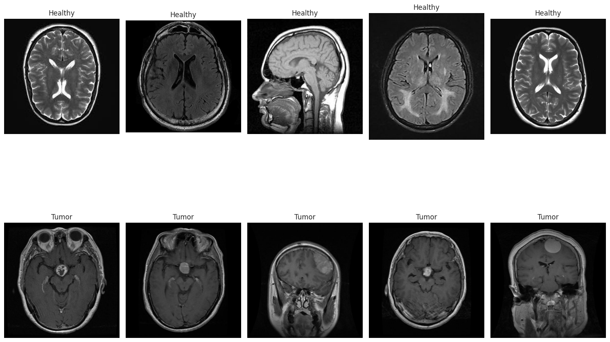

# Brain Tumor MRI Classification with RESNet and Area Attention

This project implements a **RESNet-based convolutional neural network** with **Area Attention** to classify MRI images of brain tumors. We trained and validated our model on the MRI images from the dataset available at [Kaggle](https://www.kaggle.com/datasets/murtozalikhon/brain-tumor-multimodal-image-ct-and-mri).

## 📌 Model Overview

We used a **RESNet-inspired architecture** with residual blocks and **Area Attention layers** to enhance feature extraction. Our architecture consists of:
- A **stem convolutional layer** to preprocess input images.
- Multiple **CNN blocks with residual connections** for feature extraction.
- **Area Attention layers** to focus on important regions.
- **Downsampling layers** to reduce spatial dimensions.
- A **global average pooling layer** followed by a fully connected layer for classification.

## 🚀 Training Details

- **Dataset**: MRI images from the Kaggle dataset.
- **Image size**: Resized to **224x224**.
- **Normalization**: Mean and std set to `[0.5, 0.5, 0.5]`.
- **Optimizer**: Adam with **learning rate = 0.001**.
- **Loss function**: Binary Cross-Entropy with Logits.
- **Training-validation split**: 80%-20%.
- **Batch size**: 16.
- **Number of epochs**: 10.

## 🎯 Results

We achieved the following validation performance:
```
Validation Loss: 0.1357, Accuracy: 96.10%
```

## 📊 Model Evaluation

To evaluate the model, we used:
- **Training & Validation Loss/Accuracy Plots**.
- **Confusion Matrix** to analyze classification performance.
- **Classification Report** with precision, recall, and F1-score.

## 🔧 Dependencies

Make sure you have the following installed:
```
Python 3.8+
Torch (Tested on PyTorch 2.0)
Torchvision
Matplotlib
Seaborn
Scikit-learn
```

## 📁 Usage

1. Clone the repository:
   ```sh
   git clone https://github.com/ganjbakhshali/Brain-Tumor-Classification.git
   cd Brain-Tumor-Classification
   ```
2. Install dependencies:
   ```sh
   pip install -r requirements.txt
   ```
3. Train the model:
   ```sh
   Run main_torch.ipynb
   ```

## ⚠️ Notes
- The **PyTorch version has been tested and works correctly**.
- Ensure your dataset is placed correctly in the `Dataset/Brain Tumor MRI images/` folder.


